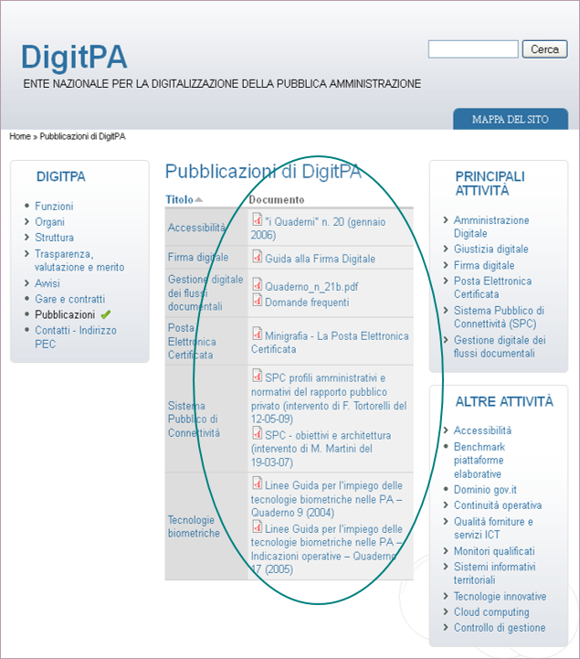
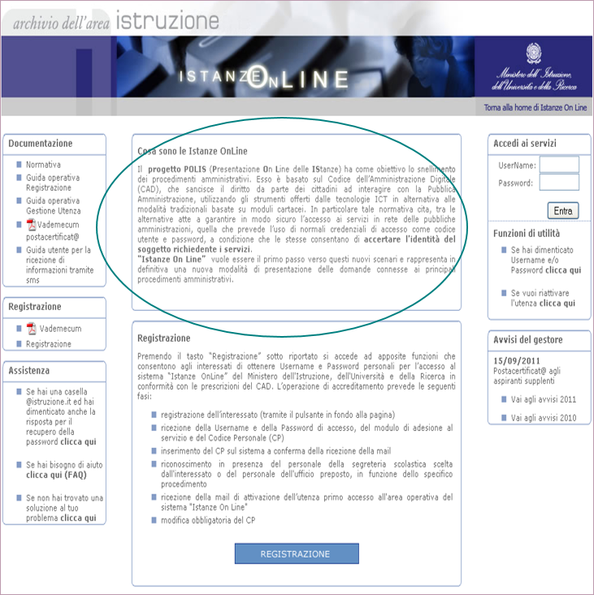
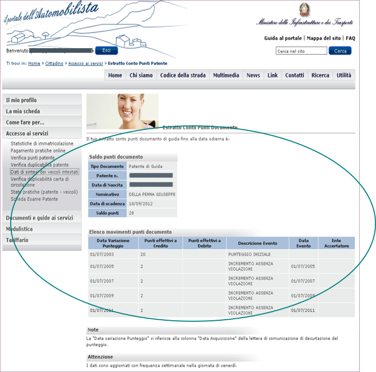
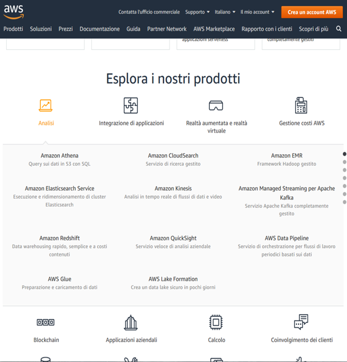
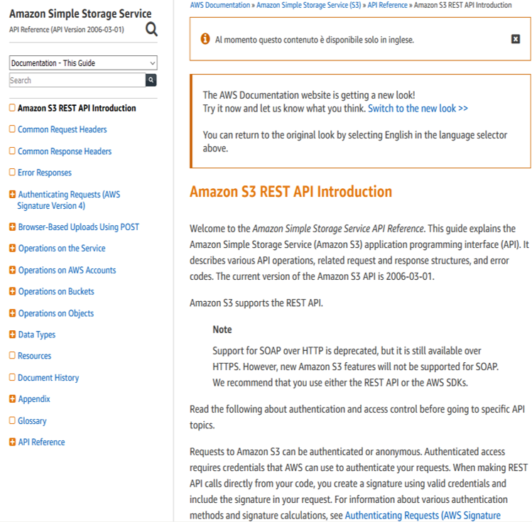
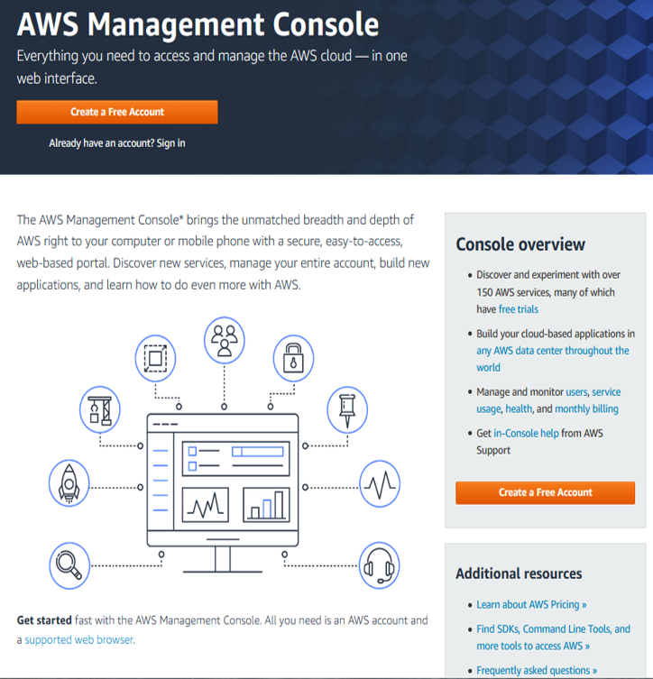
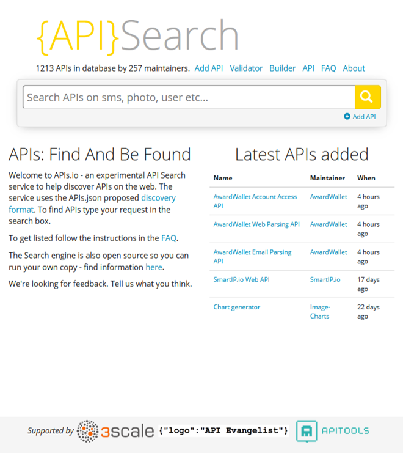
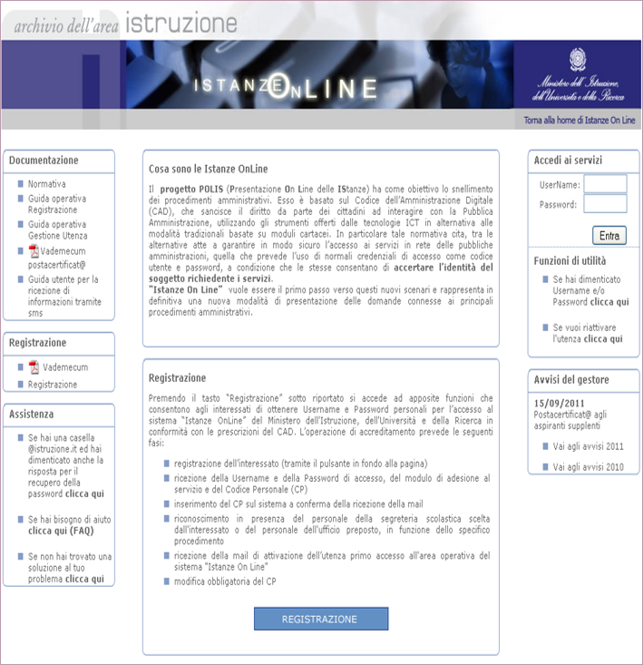
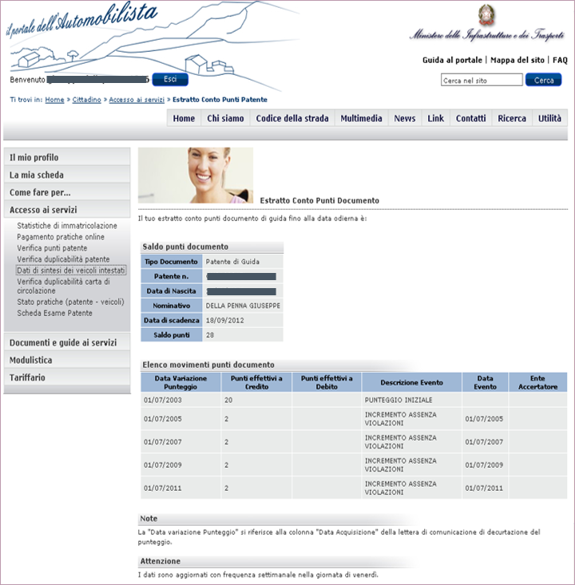

<!----------------- BEGIN SLIDE 001 it -------------------------->

#  RESTful Web Services e Web 2.0

<!----------------- COLUMN 1 -------------------------->

> 001

Giuseppe Della Penna

Università degli Studi di L'Aquila  
giuseppe.dellapenna@univaq.it  
http://people.disim.univaq.it/dellapenna

> *Questo documento si basa sulle slide del corso di Web Engineering, riorganizzate per una migliore esperienza di lettura. Non è un libro di testo completo o un manuale tecnico, e deve essere utilizzato insieme a tutti gli altri materiali didattici del corso. Si prega di segnalare eventuali errori o omissioni all'autore.*

> Quest'opera è rilasciata con licenza CC BY-NC-SA 4.0. Per visualizzare una copia di questa licenza, visitate il sito https://creativecommons.org/licenses/by-nc-sa/4.0

<!----------------- BEGIN TOC -------------------------->

 - [1. Servizi sul Web, Servizi Web, Web Services…](#1-servizi-sul-web-servizi-web-web-services…)

    - [1.1. Documenti e modulistica online = servizio web?](#11-documenti-e-modulistica-online-=-servizio-web)

    - [1.2. Procedure amministrative online = servizio web?](#12-procedure-amministrative-online-=-servizio-web)

    - [1.3. Dati amministrativi online = servizio web?](#13-dati-amministrativi-online-=-servizio-web)

 - [2. Web Services nel Web 2.0](#2-web-services-nel-web-20)

    - [2.1. Amazon Web Services](#21-amazon-web-services)

    - [2.2. La diffusione dei Web Service](#22-la-diffusione-dei-web-service)

    - [2.3. Procedure amministrative come web service?](#23-procedure-amministrative-come-web-service)

    - [2.4. Dati amministrativi online come web service?](#24-dati-amministrativi-online-come-web-service)

 - [3. RESTful Web Services](#3-restful-web-services)

<!------------------- END TOC --------------------------> 

<!------------------- END SLIDE 001 it -------------------------->

<!----------------- BEGIN SLIDE 002 it -------------------------->

## 1. Servizi sul Web, Servizi Web, Web Services…

<!----------------- COLUMN 1 -------------------------->

> 002

Prima di iniziare a parlare di (RESTful) Web Services, è necessario capire quale tipo di servizi possono essere realizzati sul web, e quali di questi siano effettivamente definibili web services.

C'è molta confusione, infatti, su cosa siano e cosa possano effettivamente fare i web services! 

<!------------------- END SLIDE 002 it -------------------------->

<!----------------- BEGIN SLIDE 003 it -------------------------->

### 1.1. Documenti e modulistica online = servizio web?

<!----------------- COLUMN 1 -------------------------->

> 003

 

<!----------------- COLUMN 2 -------------------------->

È la più sviluppata e più primitiva forma di servizio messo a disposizione tramite il web.

Utilissimo per i cittadini, automatizza però solo la parte più semplice delle procedure amministrative.

Fornire documentazione e modulistica è senz'altro un servizio, e trova sul web la sua sede ideale, tuttavia è in servizio effettuato tramite web, non un web service. 

<!------------------- END SLIDE 003 it -------------------------->

<!----------------- BEGIN SLIDE 004 it -------------------------->

### 1.2. Procedure amministrative online = servizio web?

<!----------------- COLUMN 1 -------------------------->

> 004

 

<!----------------- COLUMN 2 -------------------------->

Lo sviluppo e l'informatizzazione delle procedure amministrative permette di migrare queste ultime totalmente sul web.

- Compilazione assistita dei moduli 

- Presentazione online delle domande

- Tracciabilità di tutte le successive fasi di gestione

- Ricezione elettronica delle risposte

In questo caso il concetto di servizio offerto via web è completo, ma non si tratta ancora di un web service. 

<!------------------- END SLIDE 004 it -------------------------->

<!----------------- BEGIN SLIDE 005 it -------------------------->

### 1.3. Dati amministrativi online = servizio web?

<!----------------- COLUMN 1 -------------------------->

> 005

 

<!----------------- COLUMN 2 -------------------------->

Anche la consultazione e la modifica di dati raccolti tramite procedure cartacee o generalmente difficili da accedere costituisce un utile servizio da esporre sul web.

Questo adattamento favorisce anche lo scambio di informazioni tra soggetti diversi: l'accesso via web facilita lo scambio di dati con un protocollo diffuso (HTTP) e delle codifiche ampiamente conosciute (HTML e altri formati tipicamente usati sul web)

Tuttavia, non siamo ancora al livello di un vero web service, perché quest'ultimo richiede almeno una caratteristica in più: l'interfacciamento (automatico) con altri sistemi automatici. 

<!------------------- END SLIDE 005 it -------------------------->

<!----------------- BEGIN SLIDE 006 it -------------------------->

## 2. Web Services nel Web 2.0

<!----------------- COLUMN 1 -------------------------->

> 006

> Web 2.0 can be described in 3 parts:
> 
> - Rich Internet application (RIA) — defines the experience brought from desktop to browser whether it is from a graphical point of view or usability point of view. 
> - Web-oriented architecture (WOA) — is a key piece in Web 2.0, which defines how Web 2.0 applications expose their functionality so that other applications can leverage and integrate the functionality providing a set of much richer applications.
> - Social Web — defines how Web 2.0 tends to interact much more with the end user and make the end-user an integral part.
> 
> (Wikipedia)

I servizi web sono nati prima della definizione di Web 2.0, ma ora ne sono parte integrante, sebbene costituiscano una caratteristica di livello più basso rispetto a quelle più note ed "evidenti" del nuovo web, cioè le RIA e gli aspetti sociali. 

<!------------------- END SLIDE 006 it -------------------------->

<!----------------- BEGIN SLIDE 007 it -------------------------->

### 2.1. Amazon Web Services

<!----------------- COLUMN 1 -------------------------->

> 007

 

<!----------------- COLUMN 2 -------------------------->

Un esempio di web services "a 360 gradi" è costituito dai servizi Amazon.  

Si tratta di una collezione di servizi eterogenei, che vanno dal *cloud storage*, alla gestione remota dei dati e delle computazioni.

Tutto, quindi all'insegna dell'integrazione tra sistemi informativi differenti effettuata tramite web. 

<!------------------- END SLIDE 007 it -------------------------->

<!----------------- BEGIN SLIDE 008 it -------------------------->

####  Amazon AWS: come si usano?

<!----------------- COLUMN 1 -------------------------->

> 008

 

<!----------------- COLUMN 2 -------------------------->

Un web service **non è un prodotto per l'utente finale**: può essere usato dai programmatori per realizzare servizi diretti a questo tipo di utenza, ma non solo. 

La documentazione di un web service **non è un manuale operativo**, come nei primi esempi che abbiamo visto, ma una sorta di guida alla programmazione!

Il servizio si espone tramite standard unificati: **REST**, SOAP, ecc… 

<!------------------- END SLIDE 008 it -------------------------->

<!----------------- BEGIN SLIDE 009 it -------------------------->

####  Amazon AWS: accesso via web

<!----------------- COLUMN 1 -------------------------->

> 009

 

<!----------------- COLUMN 2 -------------------------->

Un web service può essere, del tutto o in parte, utilizzabile anche tramite web browser, nella modalità vista per i servizi sul web che abbiamo già illustrato.

L'accesso web al web service non è altro che un'applicazione client per il servizio stesso, sviluppata separatamente dal servizio, anche da terze parti. 

<!------------------- END SLIDE 009 it -------------------------->

<!----------------- BEGIN SLIDE 010 it -------------------------->

### 2.2. La diffusione dei Web Service

<!----------------- COLUMN 1 -------------------------->

> 010

 

<!----------------- COLUMN 2 -------------------------->

Spesso si crede che i servizi web **debbano essere necessariamente pubblici come le pagine web**.

In realtà, molti servizi web sono attivi sulle **intranet**, come meccanismo di scambio dati tra applicazioni e personale di enti e aziende.

Molti altri servizi web sono esposti all'esterno, ma utilizzabili **solo previa iscrizione** (e pagamento!)

È possibile creare **servizi ad accesso ibrido**, che sono esposti solo in parte al pubblico e/o all'accesso *anonimo*, predisponendo interfacce specifiche per diverse tipologie d'utenza. 

<!------------------- END SLIDE 010 it -------------------------->

<!----------------- BEGIN SLIDE 011 it -------------------------->

### 2.3. Procedure amministrative come web service?

<!----------------- COLUMN 1 -------------------------->

> 011

 

<!----------------- COLUMN 2 -------------------------->

Procedure come quelle già illustrate possono essere realizzate sotto forma di interazioni con un web service effettuate tramite un'interfaccia web.

Ciò rende il canale di fruizione (l'interfaccia) totalmente disaccoppiato dal servizio, con enormi vantaggi in caso di ristrutturazione dei siti.

Inoltre, il servizio definito più formalmente come web service è più controllabile, semplice da mantenere e da modificare.

L'utente finale, in questo caso, non percepisce sensibili differenze, ma le possibilità del fornitore del servizio si estendono. 

<!------------------- END SLIDE 011 it -------------------------->

<!----------------- BEGIN SLIDE 012 it -------------------------->

### 2.4. Dati amministrativi online come web service?

<!----------------- COLUMN 1 -------------------------->

> 012

 

<!----------------- COLUMN 2 -------------------------->

L'accesso e la modifica diretta di dati è un compito tipico per un web service che, nel web 2.0, sostituisce quello che veniva comunemente chiamato "*(web) scraping*".  

Una volta realizzato il servizio, la sua descrizione formale semplificherà la creazione (semi-automatica) di client che permettono non solo di accedere ai dati tramite pagine web, ma anche di scambiare queste informazioni con altri sistemi informativi e applicazioni, rendendo il dato immediatamente e automaticamente accessibile ovunque sia necessario. 

<!------------------- END SLIDE 012 it -------------------------->

<!----------------- BEGIN SLIDE 013 it -------------------------->

## 3. RESTful Web Services

<!----------------- COLUMN 1 -------------------------->

> 013

I servizi web RESTful, in particolare, sono   *semanticamente* adatti per applicazioni in cui:

- Si **manipolano dati** tramite le classiche *CRUD operations*.  

- I dati sono **organizzati** in maniera gerarchica (come spesso accade nei database *noSQL*) o connessi da relazioni logiche (come nei DB relazionali).

- *Gli esempi "Amazon" e "Dati amministrativi" sono di questo tipo*

I servizi web RESTful sono   *semanticamente* meno adatti a creare API generiche, in cui si espongono metodi non direttamente legati al concetto da dati. Tuttavia, sono ormai usati anche a questo scopo, con qualche estensione.

- *L'esempio "procedure amministrative" è (in parte) di questo tipo*. 

<!------------------- END SLIDE 013 it -------------------------->
